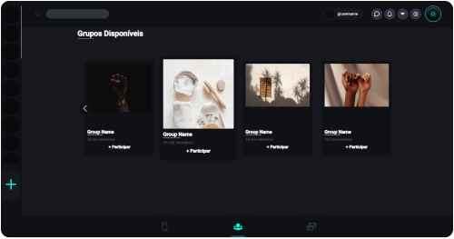

### Hello world! 

#

## **if you are going to start the project, do the following:**

1.  **install the project dependencies:** ```yarn```
2.  **start:** ```yarn start```

**access:**   http://localhost:3000
#

**🧪 tests:** ```yarn test```


**🌌 preview** **(** 1000 **x** 524.31 **)**




**🔧 technologies used**


**contact me**:

[](https://www.linkedin.com/in/marcos-proença-5820101b1)
[](mailto:marcosproenca144@gmail.com)
<br/>


## **front-end** && **back-end**